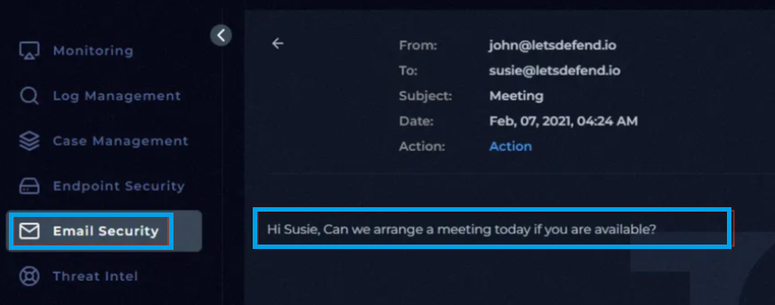
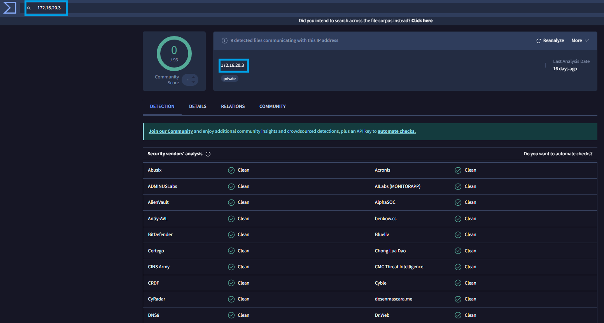
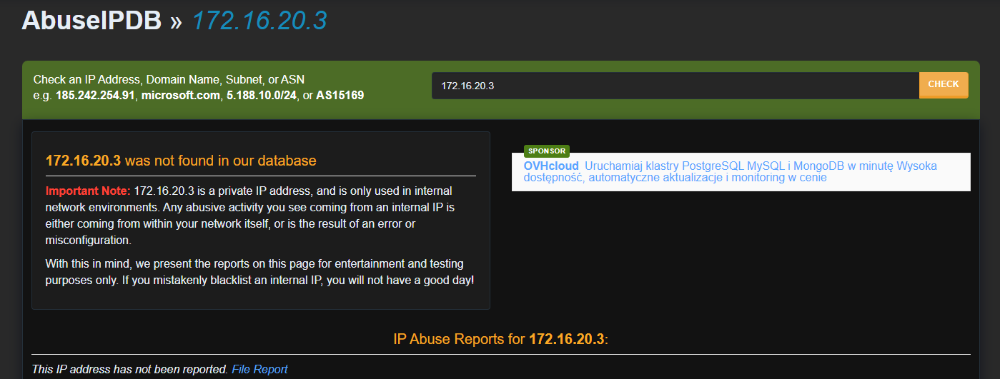
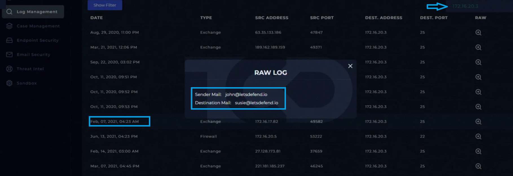
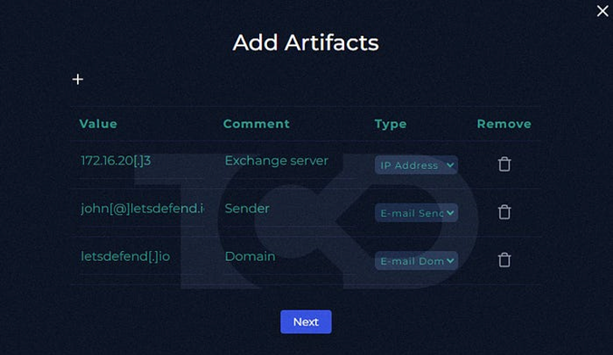

# 📄 Name of the completed project :
**Incident analysis: Phishing Mail Detected – Internal to Internal**

---

## 📅 Incident Details

- **Event ID**: 52  
- **Event Time**: Feb, 07, 2021, 04:24 AM 
- **Detection Rule**: SOC120 - Phishing Mail Detected - Internal to Internal
- **Alert Level**: Security Analyst  
- **Type**: Exchange
- **Device Action**: Allowed
---

## 📁 SUMMARY

On February 7, 2021, at 4:24 A.M., our system sent an alert regarding an internal email sent from “john@letsdefend.io” to “susie@letsdefend.io.” 
This message contained information about a meeting. The message read: “Hi Susie, can we schedule a meeting today if you have time?” Both emails had the domain “letsdefend[.]io.”

**Details of this Incients:**
- SMTP Address: 172.16.20.3
- Sender address: john@letsdefend.io
- Recipient address: Susie@letsdefend.io

---

## 🛠️ Tools

The following tools were used in this alert:

- [VirusTotal](https://www.virustotal.com/)
- [AbuseIPDB](https://www.abuseipdb.com/)

## 📸 Photos of Incidents:

In our Playbook we have a few question before we starting the analysis. This information about the incoming email should be obtained:

<p align="center">
  
  <br>
  <em>Figure 1: Email Questions Analysis</em>
</p>

Answers to these questions after conducting the analysis:
- **When was it sent?** February 7, 2021, at 4:24 A.M  
- **What is the email's SMTP address?** 172[.]16[.]20[.]3  
- **What is the sender address?** john@letsdefend[.]io  
- **What is the recipient address?** susie@letsdefend[.]io  
- **Is the mail content suspicious?** No, the content isn't suspicious  
- **Are there any attachments?** No, there are no attachments 
<p align="center">
  
  <br>
  <em>Figure 2: Email Message</em>
</p>

The IP address 172[.]16[.]20[.]3 was analyzed using VirusTotal. 
The scan results showed 0 detections across all security vendors, 
indicating no known malicious activity or reputation concerns at the time of analysis.

<p align="center">
  
  <br>
  <em>Figure 3: VirusTotal Screenshot</em>

Additionally, we verify this information in the AbuseIPDB database.
In this case, no suspicious traces were found either.

</p>
<p align="center">
  
  <br>
  <em>Figure 4: AbuseIPDB Screenshot</em>
</p>

The next step is to verify the information regarding log management.
The logs are very extensive, but this is due to the fact that they are logs from the mail server.
The logs corresponding to the date of the alert provide detailed information regarding the event detected by the security monitoring system.

</p>
<p align="center">
  
  <br>
  <em>Figure 5: Log Management</em>
</p>

After completing the investigation and gathering all relevant evidence, the findings were analyzed, final conclusions were determined, and supporting artifacts were included to document the investigation process.
These artifacts include:
</p>
<p align="center">
  
  <br>
  <em>Figure 6: Artifacts</em>
</p>

The final results after the case was closed:
</p>
<p align="center">
  
  <br>
  <em>Figure 7: Results_of_my_research</em>
</p>
The Investigations SUMMARY:

On February 7, 2021, at 4:24 A.M., our system sent an alert regarding an internal email sent from “john@letsdefend.io” to “susie@letsdefend.io.” This message contained information about a meeting. The message read: “Hi Susie, can we schedule a meeting today if you have time?” Both emails had the domain “letsdefend[.]io.”
Based on the completed investigation and the collected evidence, the alert has been classified as a false positive.

## 🔥 Lessons Learned

Although the alert was ultimately classified as a false positive, it provided valuable insight into handling events that commonly occur in a SOC environment.

Such incidents should never be underestimated and require consistent, detailed analysis, as they may contain hidden malicious artifacts.

Every alert must be properly validated, even if it initially appears insignificant. As SOC analysts, we must remain vigilant and approach each investigation in a structured manner.

This laboratory training gave us the following skills:
- it strengthened our skills in using online tools such as AbusedIPDB and VirusTotal.
- detecting threats
- gathering information about threats
- documenting incident response

## 📂 Project Structure

```bash
SOC120_Phishing_Mail_Detected/
│
├── 00_README/
│   └── README.md
│
├── 01_Email/
│   ├── Email_Questions.png
│   └── Email_Security.png
│
├── 02_Tools_VT_&_AbuseIPDB/
│   ├── AbuseIPDB.png
│   └── VirusTotal.png
│
├── │03_Logs_Analysis/
│   └── Logs.png
│
├── 04_Analysis_of_Investigations/
│   ├── Artifacts.png
│   └── Results_of_my_research.png
```
