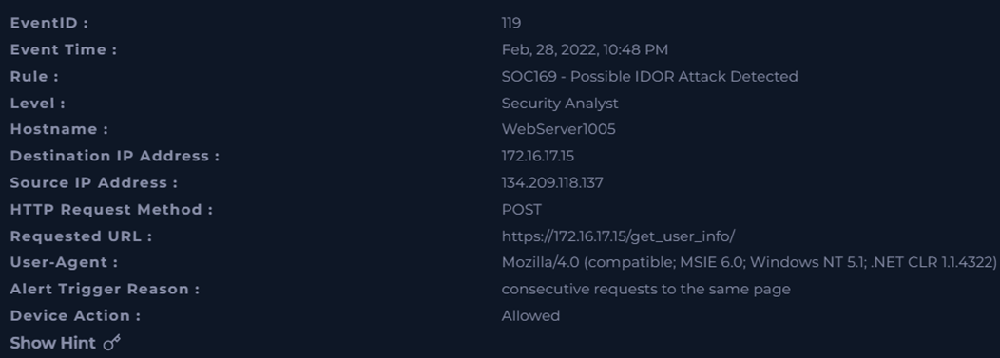
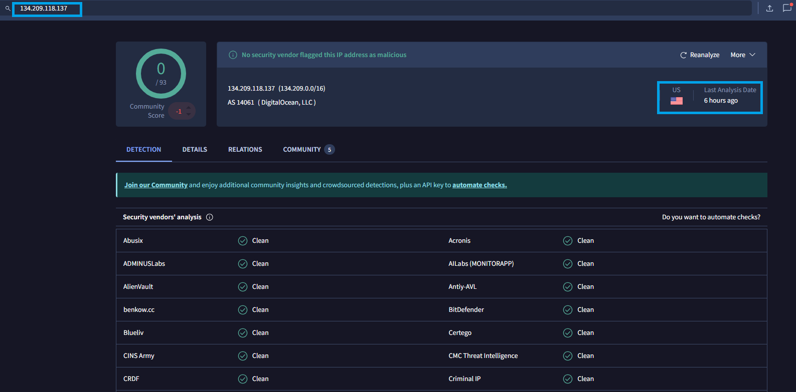
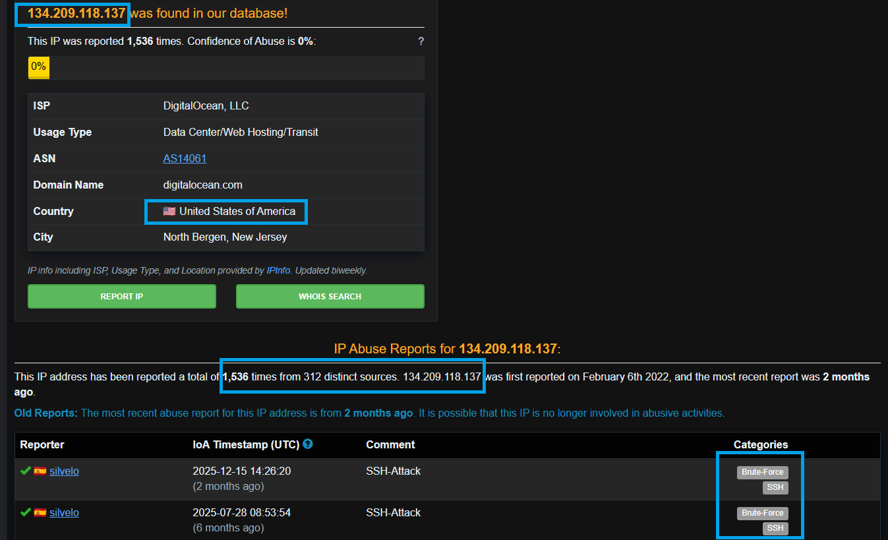
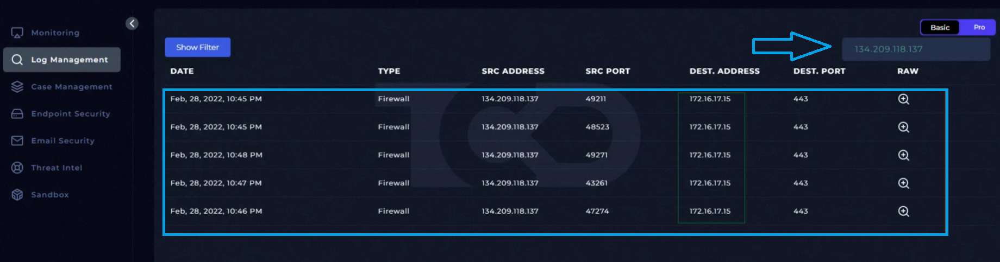
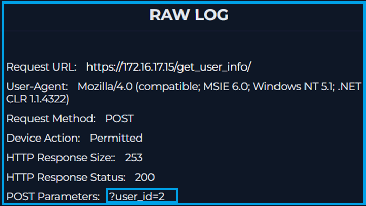
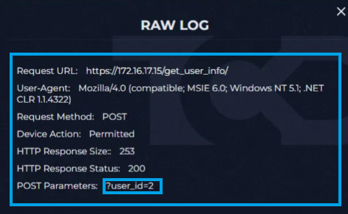
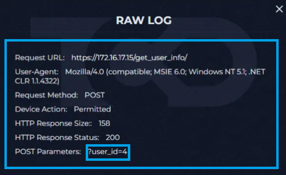

# 📄 Name of the completed project :
**Incident analysis: Possible IDOR Attack Detected**

---

## 📅 Incident Details

- **Event ID**: 119 
- **Event Time**: Feb, 28, 2022, 10:48 PM 
- **Detection Rule**: SOC169 - Possible IDOR Attack Detected
- **Alert Level**: Security Analyst  
- **Type**: Web Attack
- **Requested URL**: https[:]//172[.]16[.]17[.]15/get_user_info/
- **Device Action**: Allowed
---

## 📁 SUMMARY

On February 7, 2021, at 4:24 A.M., our system sent an alert regarding an internal email sent from “john@letsdefend.io” to “susie@letsdefend.io.” 
This message contained information about a meeting. The message read: “Hi Susie, can we schedule a meeting today if you have time?” Both emails had the domain “letsdefend[.]io.”

**Details of this Incients:**
- SMTP Address: 172.16.20.3
- Sender address: john@letsdefend.io
- Recipient address: Susie@letsdefend.io

---

## 🛠️ Tools

The following tools were used in this alert:

- [VirusTotal](https://www.virustotal.com/)
- [AbuseIPDB](https://www.abuseipdb.com/)
- [MalwareURL](https://www.malwareurl.com/listing-urls.php)
  
## 🔐 IDOR (Insecure Direct Object Reference) - What is the IDOR? - the most important informations

**IDOR** is a security vulnerability where an application provides direct access to an object (e.g., user ID, file) without checking whether the user has the right to access that resource.
In other words, the application trusts all data provided by the user, which they enter in the URL parameter or HTTP request.

<u>Example</u>:
Let's assume that the application has the following address:

https://exercise.com/account?id=111

id=111 - user account

The user is logged in as ID 111.

The attacker changes the parameter in the URL to:

https://exercise.com/account?id=112

If the application does not verify whether the logged-in user can access account 112, but only retrieves data from the database by ID alone, the attacker will gain access to someone else's data, which should never happen. This results in unauthorized access to another user's data, which constitutes a breach of access control.

## 📸 Photos of Incidents:

The alert was generated on **February 28, 2022, at 10:48 P.M.** and was described as an IDOR attack. The incident involved the **WebServer1005** server with the address **172.16.17.15**(Destination IP Address), to which requests were sent from the external IP address **134.209.118.137**(Source IP Address). Multiple consecutive **POST** requests were detected. 

The User-Agent was identified as **Mozilla/4.0 (MSIE 6.0 on Windows NT 5.1 with .NET CLR 1.1.4322)**, which may suggest the use of an automated tool or a non-standard client. The reason for generating the alert was successive requests to the same page. However, the traffic was marked as **Allowed**, which means that the system did not block the suspicious activity.
<p align="center">
  
  <br>
  <em>Figure 1: Incident_Details</em>
</p>


The source IP address **134[.]209[.]118[.]137** was analyzed using VirusTotal.
The scan results showed 0 threats detected by all security vendors,
indicating that no known malicious activity or reputation issues were found at the time of analysis. Only in the Community Score section do we see information about some malicious activity, which we cannot ignore. To be sure, we will check the same IP address using the AbuseIPDB tool. 

This address originates from the United States.

<p align="center">
  
  <br>
  <em>Figure 2: VirusTotal Screenshot</em>

Additionally, we verify this information in the AbuseIPDB database.
The AbuseIPDB website generated a report on the specified IP address **134[.]209[.]118[.]137**. This address was found in the database and has been reported **1,536 times**, with a “Confidence of Abuse” rating of 0%. Technical details are visible, such as the service provider (**DigitalOcean, LLC**), type of use (**Data Center/Web Hosting/Transit**), and the domain digitalocean.com. 

Server location: **United States, North Bergen, New Jersey**.

The “IP Abuse Reports” section contains information on the number of reports from 312 different sources. The table shows sample reports where the comment indicates “SSH-Attack” and its category is “Brute-Force” and “SSH”. After analyzing both sources, it can now be concluded that this address has suspicious intentions.

</p>
<p align="center">
  
  <br>
  <em>Figure 3: AbuseIPDB Screenshot</em>
</p>

The next step is to verify the log management information.
Five entries were found, and their dates and times are very close to the data contained in the alert.

</p>
<p align="center">
  
  <br>
  <em>Figure 4: Log Management</em>
</p>
The logs show that the attacker sent POST requests to five different user_ids in a short period of time. The status of each request is 200, which at first glance may indicate that the attack was successful. 

The first example log:
</p>
<p align="center">
  
  <br>
  <em>Figure 5: Raw_logs_1 - user_id=1</em>
</p>

The second example log:
</p>
<p align="center">
  
  <br>
  <em>Figure 6: Raw_logs_2 - user_id=2</em>
</p>

The third example log:
</p>
<p align="center">
  
  <br>
  <em>Figure 7: Raw_logs_3 - user_id=4</em>
</p>

The attacker sent several requests with different values for the user_id=x parameter.

IDOR (Insecure Direct Object Reference) occurs when an application provides a direct reference to a resource (e.g., user_id, order_id, file_id) and does not verify whether the currently logged-in user has access rights to the specified object.

If the application only checks whether the user is logged in, but does not check whether the resource belongs to them, the attacker can modify the parameter in the request and gain access to another user's data, which was most likely the case with this alert.


After completing the investigation and gathering all relevant evidence, the findings were analyzed, final conclusions were determined, and supporting artifacts were included to document the investigation process.
These artifacts include:

The third example log:


| Value                                | Comment                      | Type        |
| -----------------------------------  | ---------------------------- | ----------- |
| 134[.]209[.]118[.]137                | Source malicious IP Address  | IP Address  |  
| hxxps://172.16.17.15/get_user_info/  | IDOR malicious request       | URL Address |
| 172[.]16[.]17[.]15                   | Server IP address            | IP Address  |
| digitalocean[.]com                   | Threat actor domain          | URL Address | 


The final results after the case was closed:
</p>
<p align="center">
  
  <br>
  <em>Figure 7: Results_of_my_research</em>
</p>
The Investigations SUMMARY:

On February 7, 2021, at 4:24 A.M., our system sent an alert regarding an internal email sent from “john@letsdefend.io” to “susie@letsdefend.io.” This message contained information about a meeting. The message read: “Hi Susie, can we schedule a meeting today if you have time?” Both emails had the domain “letsdefend[.]io.”
Based on the completed investigation and the collected evidence, the alert has been classified as a false positive.

## 🔥 Lessons Learned

Although the alert was ultimately classified as a false positive, it provided valuable insight into handling events that commonly occur in a SOC environment.

Such incidents should never be underestimated and require consistent, detailed analysis, as they may contain hidden malicious artifacts.

Every alert must be properly validated, even if it initially appears insignificant. As SOC analysts, we must remain vigilant and approach each investigation in a structured manner.

This laboratory training gave us the following skills:
- it strengthened our skills in using online tools such as AbusedIPDB, VirusTotal an MalwareURL.
- learning a new attack method - IDOR and how to detect and eliminate it
- detecting threats
- gathering information about threats
- documenting incident response

## 📂 Project Structure

```bash
SOC120_Phishing_Mail_Detected/
│
├── 00_README/
│   └── README.md
│
├── 01_Email/
│   ├── Email_Questions.png
│   └── Email_Security.png
│
├── 02_Tools_VT_&_AbuseIPDB/
│   ├── AbuseIPDB.png
│   └── VirusTotal.png
│
├── │03_Logs_Analysis/
│   └── Logs.png
│
├── 04_Analysis of Investigations/
│   ├── Artifacts.png
│   └── Results_of_my_research.png
```

