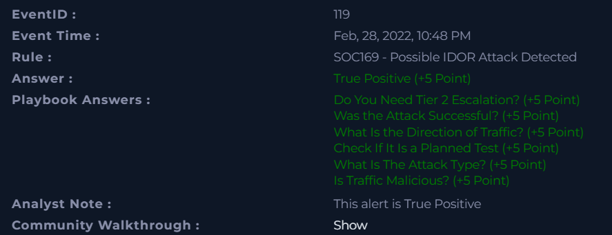

# 📄 Name of the completed project :
**Incident analysis: Possible IDOR Attack Detected**

---

## 📅 Incident Details

- **Event ID**: 119 
- **Event Time**: Feb, 28, 2022, 10:48 PM 
- **Detection Rule**: SOC169 - Possible IDOR Attack Detected
- **Alert Level**: Security Analyst  
- **Type**: Web Attack
- **Requested URL**: https[:]//172[.]16[.]17[.]15/get_user_info/
- **Device Action**: Allowed
---

## 📁 SUMMARY

On February 28, 2022, at 10:48 P.M., our monitoring system triggered an alert and identified activity consistent with a potential IDOR attack. The requested URL was “hxxps://172.16.17.15/get_user_info/”, originating from the source IP address 134.209.118.137.

An analysis of the reputation of the suspicious IP address 134.209.118.137 using the VirusTotal tool did not reveal any active detections by security engines. At the time of analysis, the scan result showed 0 detections, which means that there were no confirmed malicious activities according to the available security providers.

However, attention should be paid to the Community Score section, which contained reports suggesting potentially malicious activity. This information cannot be ignored and requires further verification.

The AbuseIPDB tool was also used to confirm the reputation of the IP address, which classified the specified address as malicious. The analysis showed that the IP address is associated with the digitalocean[.]com domain and is located in the United States.

The POST requests sent to the URL by the threat actor were successful, as indicated by the HTTP 200 response status code. Immediate blocking of the identified IP address is recommended, and the incident should be escalated to the SOC L2 team for further investigation.

---

## 🛠️ Tools

The following tools were used in this alert:

- [VirusTotal](https://www.virustotal.com/)
- [AbuseIPDB](https://www.abuseipdb.com/)
- [MalwareURL](https://www.malwareurl.com/listing-urls.php)
  
## 🔐 IDOR (Insecure Direct Object Reference) - What is the IDOR? - the most important informations

**IDOR** is a security vulnerability where an application provides direct access to an object (e.g., user ID, file) without checking whether the user has the right to access that resource.
In other words, the application trusts all data provided by the user, which they enter in the URL parameter or HTTP request.

<u>Example</u>:
Let's assume that the application has the following address:

https://exercise.com/account?id=111

id=111 - user account

The user is logged in as ID 111.

The attacker changes the parameter in the URL to:

https://exercise.com/account?id=112

If the application does not verify whether the logged-in user can access account 112, but only retrieves data from the database by ID alone, the attacker will gain access to someone else's data, which should never happen. This results in unauthorized access to another user's data, which constitutes a breach of access control.

## 📸 Photos of Incidents:

The alert was generated on **February 28, 2022, at 10:48 P.M.** and was described as an IDOR attack. The incident involved the **WebServer1005** server with the address **172.16.17.15**(Destination IP Address), to which requests were sent from the external IP address **134.209.118.137**(Source IP Address). Multiple consecutive **POST** requests were detected. 

The User-Agent was identified as **Mozilla/4.0 (MSIE 6.0 on Windows NT 5.1 with .NET CLR 1.1.4322)**, which may suggest the use of an automated tool or a non-standard client. The reason for generating the alert was successive requests to the same page. However, the traffic was marked as **Allowed**, which means that the system did not block the suspicious activity.
<p align="center">
  
  <br>
  <em>Figure 1: Incident_Details</em>
</p>


The source IP address **134[.]209[.]118[.]137** was analyzed using VirusTotal.
The scan results showed 0 threats detected by all security vendors,indicating that no known malicious activity or reputation issues were found at the time of analysis. Only in the Community Score section do we see information about some malicious activity, which we cannot ignore. To be sure, we will check the same IP address using the AbuseIPDB tool. 

This address originates from the United States.

<p align="center">
  
  <br>
  <em>Figure 2: VirusTotal Screenshot</em>

Additionally, we verify this information in the AbuseIPDB database.
The AbuseIPDB website generated a report on the specified IP address **134[.]209[.]118[.]137**. This address was found in the database and has been reported **1,536 times**, with a “Confidence of Abuse” rating of 0%. Technical details are visible, such as the service provider (**DigitalOcean, LLC**), type of use (**Data Center/Web Hosting/Transit**), and the domain digitalocean.com. 

Server location: **United States, North Bergen, New Jersey**.

The “IP Abuse Reports” section contains information on the number of reports from 312 different sources. The table shows sample reports where the comment indicates “SSH-Attack” and its category is “Brute-Force” and “SSH”. After analyzing both sources, it can now be concluded that this address has suspicious intentions.

</p>
<p align="center">
  
  <br>
  <em>Figure 3: AbuseIPDB Screenshot</em>
</p>

The next step is to verify the log management information.
Five entries were found, and their dates and times are very close to the data contained in the alert.

</p>
<p align="center">
  
  <br>
  <em>Figure 4: Log Management</em>
</p>
The logs show that the attacker sent POST requests to five different user_ids in a short period of time. The status of each request is 200, which at first glance may indicate that the attack was successful. 

The first example log:
</p>
<p align="center">
  
  <br>
  <em>Figure 5: Raw_logs_1 - user_id=1</em>
</p>

The second example log:
</p>
<p align="center">
  
  <br>
  <em>Figure 6: Raw_logs_2 - user_id=2</em>
</p>

The third example log:
</p>
<p align="center">
  
  <br>
  <em>Figure 7: Raw_logs_3 - user_id=4</em>
</p>

The attacker sent several requests with different values for the user_id=x parameter.

IDOR (Insecure Direct Object Reference) occurs when an application provides a direct reference to a resource (e.g., user_id, order_id, file_id) and does not verify whether the currently logged-in user has access rights to the specified object.

If the application only checks whether the user is logged in, but does not check whether the resource belongs to them, the attacker can modify the parameter in the request and gain access to another user's data, which was most likely the case with this alert.


After completing the investigation and gathering all relevant evidence, the findings were analyzed, final conclusions were determined, and supporting artifacts were included to document the investigation process.

These artifacts include:
</p>
<p align="center">


                  | Value                                | Comment                      | Type        |
                  | -----------------------------------  | ---------------------------- | ----------- |
                  | 134[.]209[.]118[.]137                | Source malicious IP Address  | IP Address  |  
                  | hxxps://172.16.17.15/get_user_info/  | IDOR malicious request       | URL Address |
                  | 172[.]16[.]17[.]15                   | Server IP address            | IP Address  |
                  | digitalocean[.]com                   | Threat actor domain          | URL Address | 
</p>


The final results after the case was closed:
</p>
<p align="center">
  
  <br>
  <em>Figure 8: Results_of_my_research</em>
</p>


The Investigations **SUMMARY**:

On February 28, 2022, at 10:48 P.M., our monitoring system generated an alert indicating activity consistent with a suspected IDOR attack. The request was made to the URL “hxxps://172.16.17.15/get_user_info/” and originated from the IP address 134.209.118.137.

An Insecure Direct Object Reference (IDOR) vulnerability allows attackers to manipulate application parameters in order to access unauthorized resources directly, such as files, database records, or user-related data.

A reputation assessment of the suspicious IP address 134.209.118.137 was conducted using VirusTotal. At the time of the review, no security vendors reported detections, and the scan result indicated zero flagged threats, suggesting no confirmed malicious classification by automated engines.

Nevertheless, the Community Score section included user reports indicating possible malicious behavior. These findings warrant additional scrutiny and should not be disregarded.

To further validate the reputation of the IP address, AbuseIPDB was consulted. This platform classified the address as malicious. Additional analysis revealed that the IP is linked to the domain digitalocean[.]com and is geolocated in the United States.

The POST requests issued to the targeted endpoint were processed successfully, as confirmed by the HTTP 200 status code returned by the server. It is recommended that the identified IP address be blocked without delay and that the incident be escalated to the SOC L2 team for comprehensive investigation.

## 🔥 Lessons Learned

After completing the investigation, the alert has been confirmed as a True Positive. 

The findings enhanced our understanding of IDOR attack patterns and helped validate the effectiveness of our detection and response procedures.

Such incidents should never be ignored and require consistent, detailed analysis, as they may contain a variety of artifacts.

Every alert must be properly verified. As SOC analysts, we must remain vigilant and approach each investigation in an orderly and methodical manner.

This laboratory training gave us the following skills:
- it strengthened our skills in using online tools such as AbusedIPDB, VirusTotal an MalwareURL.
- learning a new attack method - IDOR and how to detect and eliminate it
- detecting threats
- gathering information about threats
- documenting incident response

## 📂 Project Structure

```bash
SOC169 - Possible-IDOR-Attack-Detected/
│
├── 00_README/
│   └── README.md
│
├── 01_Details_about_incident/
│   └── Incident_Details.png
│
├── 02_Tools_VT_&_AbuseIPDB/
│   ├── AbuseIPDB.png
│   └── VirusTotal.png
│
├── 03_Logs_Analysis/
│   ├── Logs.png
│   ├── Raw_Log_1.png
│   ├── Raw_Log_2.png
│   └── Raw_Log_3.png
│
├── 04_Results_of_Investigation/
│   ├── Artifacts_table.png
│   └── Results_of_my_research.png

```

