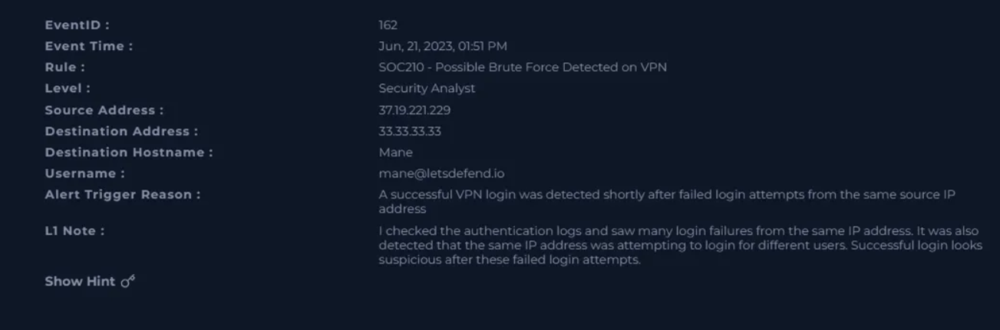
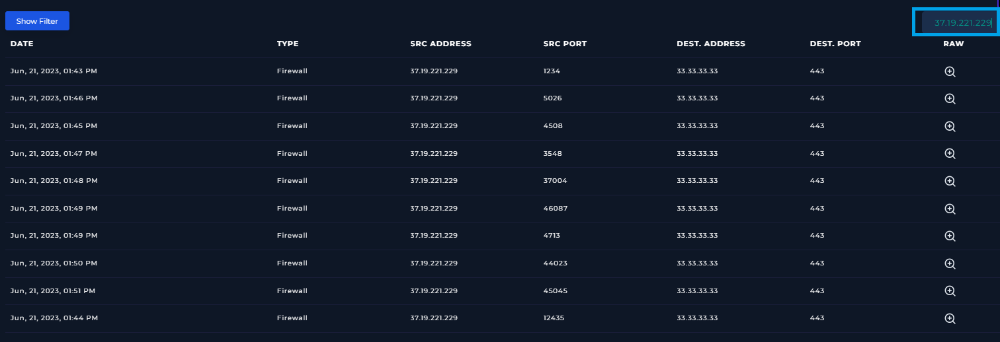
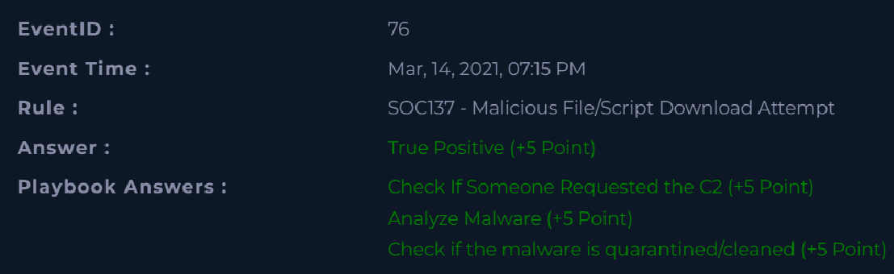

# 📄 Name of the completed project :
**Incident analysis: Possible Brute Force Detected on VPN**

---

## 📅 Incident Details

- **Event ID**: 162 
- **Event Time**: Jun, 21, 2023, 01:51 PM 
- **Detection Rule**: SOC210 — Possible Brute Force Detected on VPN
- **Source Address**: 37.19.221.229
- **Destination Address**: 33.33.33.33
- **Destination Hostname**: Mane
- **Alert Level**: Security Analyst  
- **Type**: Brute Force
- **Alert Trigger Reason**: A successful VPN login was detected shortly after failed login attempts from the same source IP address
- **L1 Note**: I checked the authentication logs and saw many login failures from the same IP address. It was also detected that the same IP address was attempting to login for different users. Successful login looks suspicious after these failed login attempts.
---

## 📁 SUMMARY


---

## 🛠️ Tools

The following tools were used in this alert:

- [VirusTotal](https://www.virustotal.com/)
- [AbuseIPDB](https://www.abuseipdb.com/)
  
## 🔐 BRUTE FORCE ATTACK - What is the IDOR? - the most important informations

A **brute force attack** is a technique that involves repeatedly and automatically trying different combinations of usernames and passwords in order to gain unauthorized access to a system, application, network service, or user account.

These attacks are usually carried out using automated tools that generate all possible character combinations (full brute force) or combinations based on word lists (dictionary attacks).

The purpose of such an attack may be to:

-- take over user accounts (e.g., *VPN*, *email*, *RDP*, *SSH*),

- gain administrative access,

- increase privileges in the environment,

- prepare for subsequent stages of the attack (e.g., *deploying malware* or *launching ransomware*).

Common indicators in logs (**IoC - Indicators of Compromise**)

This attack can be identified by:

- a large number of failed login attempts in a short period of time,

- repeated login attempts from a single IP address to multiple accounts,

- login attempts to a single account from multiple IP addresses (*distributed brute force*),

- logins at unusual times,

- a sudden increase in traffic directed to authentication services (e.g., *RDP*, *SSH*, *VPN*).

## 📸 Information and photos from the analysis of the Incident:

The alert was generated on **February 28, 2022, at 10:48 P.M.** and was described as an IDOR attack. The incident involved the **WebServer1005** server with the address **172.16.17.15**(Destination IP Address), to which requests were sent from the external IP address **134.209.118.137**(Source IP Address). Multiple consecutive **POST** requests were detected. 


<p align="center">
  
  <br>
  <em>Figure 1: Incident_Details</em>
</p>


<p align="center">
  
  <br>
  <em>Figure 2: VirusTotal Screenshot</em>

Additionally, we verify this information in the AbuseIPDB database.


</p>
<p align="center">
  
  <br>
  <em>Figure 3: AbuseIPDB_1 Screenshot</em>
</p>

</p>
<p align="center">
  
  <br>
  <em>Figure 3: AbuseIPDB_2 Screenshot</em>
</p>

The next step is to verify the log management information.
Five entries were found, and their dates and times are very close to the data contained in the alert.

</p>
<p align="center">
  
  <br>
  <em>Figure 4: Log Management</em>
</p>


These artifacts include:
</p>
<p align="center">


                          | Value                            | Comment                                    | Type           |
                          | ---------------------------------| ------------------------------------------ | -------------- |
                          | 33[.]33[.]33[.]33                | Destination IP Address                     | IP Address     |  
                          | 37[.]19[.]221[.]29               | Malicious IP address                       | IP Address     |
                          | mane@letsdefend[.]io             | Compromised credential - Email Address     | Email Address  | 
</p>


The final results after the case was closed:
</p>
<p align="center">
  
  <br>
  <em>Figure 8: Results_of_my_research</em>
</p>


**The Summary of the investigation**:


## 🔥 Lessons Learned

After completing the investigation, the alert has been confirmed as a True Positive. 

The findings enhanced our understanding of IDOR attack patterns and helped validate the effectiveness of our detection and response procedures.

Such incidents should never be ignored and require consistent, detailed analysis, as they may contain a variety of artifacts.

Every alert must be properly verified. As SOC analysts, we must remain vigilant and approach each investigation in an orderly and methodical manner.

This laboratory training gave us the following skills:
- it strengthened our skills in using online tools such as AbusedIPDB, VirusTotal an MalwareURL.
- learning a new attack method - IDOR and how to detect and eliminate it
- detecting threats
- gathering information about threats
- documenting incident response

## 📂 Project Structure

```bash
SOC169 - Possible-IDOR-Attack-Detected/
│
├── 00_README/
│   └── README.md
│
├── 01_Details_about_incident/
│   └── Incident_Details.png
│
├── 02_Tools_VT_&_AbuseIPDB/
│   ├── AbuseIPDB.png
│   └── VirusTotal.png
│
├── 03_Logs_Analysis/
│   ├── Logs.png
│   ├── Raw_Log_1.png
│   ├── Raw_Log_2.png
│   └── Raw_Log_3.png
│
├── 04_Results_of_Investigation/
│   ├── Artifacts_table.png
│   └── Results_of_my_research.png

```

